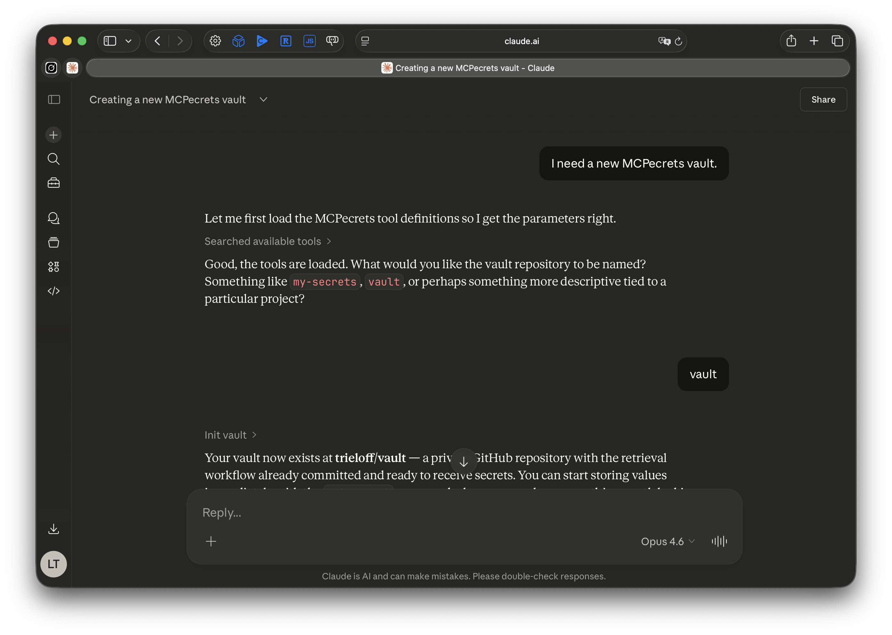
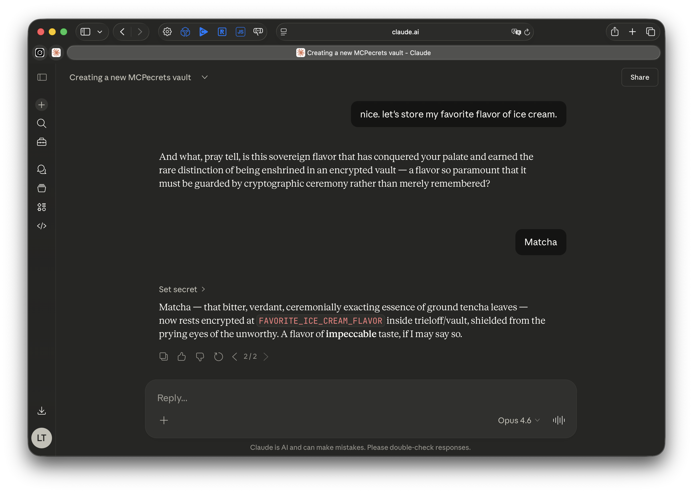
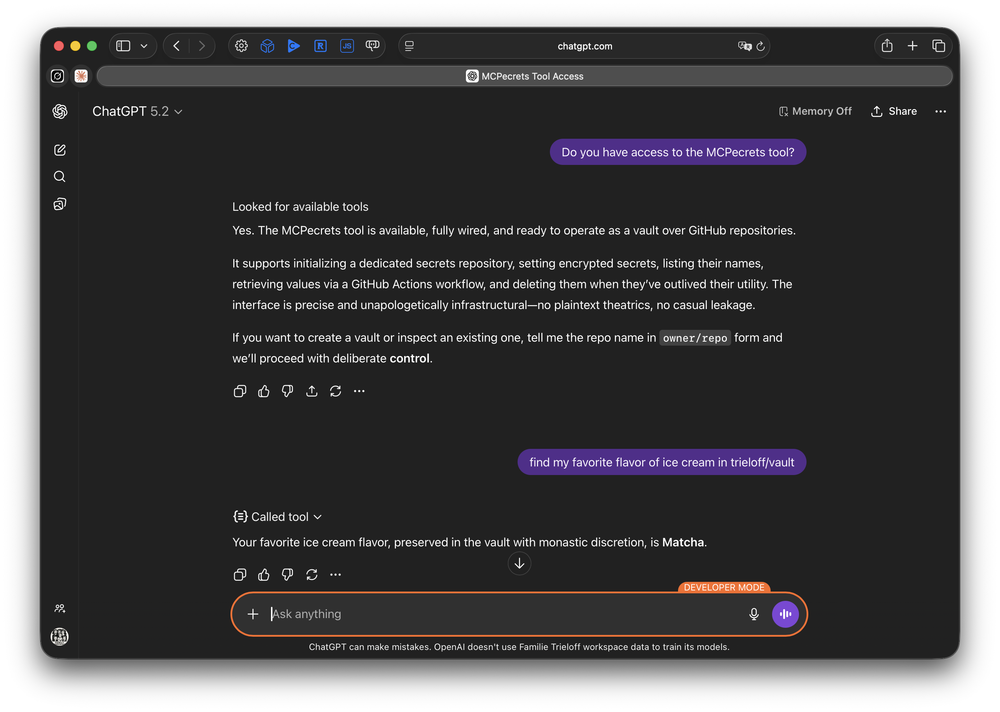

# MCPecrets

[](https://github.com/ai-ecoverse/vibe-coded-badge-action)

A lightweight MCP secrets manager that uses Cloudflare Workers for compute and GitHub for persistence.

## What it does

MCPecrets stores secrets as GitHub Actions Secrets and retrieves them via a triggered GitHub Action with ephemeral key encryption. It exposes five MCP tools over OAuth 2.1 with dynamic client registration, so it works with any MCP-compatible client -- Claude, ChatGPT, or anything else that speaks the protocol.

No database. No additional storage. Just Cloudflare Workers and GitHub.

## Screenshots

Creating a vault with `init_vault` (shown in Claude on claude.ai):



Storing a secret with `set_secret` (shown in Claude on claude.ai):



Retrieving a secret with `get_secret` -- works across MCP clients (shown here in ChatGPT on chatgpt.com):



## How it works

1. **Authentication**: OAuth 2.1 with dynamic client registration, delegating to GitHub for identity. The Worker acts as both the MCP server and the OAuth provider.
2. **Storing secrets**: Values are encrypted using the repository's public key (libsodium sealed box) and stored via the GitHub Actions Secrets API. A retrieval workflow is committed/updated in the vault repo whenever secrets change.
3. **Retrieving secrets**: The Worker generates an ephemeral X25519 keypair and triggers a GitHub Actions workflow. The workflow encrypts the secret with the ephemeral public key and POSTs the ciphertext back to the Worker. The Worker decrypts with the ephemeral private key and returns the plaintext to the MCP client.

Secrets are encrypted at rest by GitHub and encrypted in transit with ephemeral keys. The Worker never persists secret values.

## MCP Tools

| Tool | Description |
|------|-------------|
| `init_vault` | Create a new private GitHub repo as a secrets vault |
| `set_secret` | Store a secret (encrypted with the repo's public key) |
| `get_secret` | Retrieve a secret value via GitHub Actions callback |
| `list_secrets` | List secret names in a vault (values are never exposed) |
| `delete_secret` | Remove a secret from a vault |

## Setup

1. **Create a GitHub OAuth App** at [github.com/settings/developers](https://github.com/settings/developers). Set the callback URL to `https://<your-worker>.workers.dev/callback`.

2. **Deploy to Cloudflare Workers**:
   ```sh
   npm install
   npx wrangler deploy
   ```

3. **Set secrets** on the deployed Worker:
   ```sh
   npx wrangler secret put GITHUB_CLIENT_ID
   npx wrangler secret put GITHUB_CLIENT_SECRET
   ```

4. **Connect your MCP client** to `https://<your-worker>.workers.dev/mcp`. The deployed instance is at:
   ```
   https://mcpecrets.minivelos.workers.dev/mcp
   ```

## Tech Stack

- [Cloudflare Workers](https://developers.cloudflare.com/workers/) + Durable Objects + KV
- [GitHub OAuth](https://docs.github.com/en/apps/oauth-apps) + [Actions Secrets API](https://docs.github.com/en/rest/actions/secrets)
- [MCP](https://modelcontextprotocol.io/) (Streamable HTTP transport) via `@modelcontextprotocol/sdk`
- [tweetnacl](https://www.npmjs.com/package/tweetnacl) + [blakejs](https://www.npmjs.com/package/blakejs) for X25519 / sealed box crypto
- [Octokit](https://github.com/octokit/rest.js) for GitHub API
